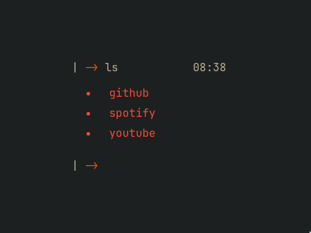

#   

The idea is to have a minimal but functional home page for your browser.  
  

<a href="https://yrwq.github.io/termstart"> Try it! </a>
  

## Usage  

Termstart is now available as an extension on Google Chrome only  
To do this:  

 1. Clone this repository to somewhere like `Documents`
 2. Start Chrome and go to `chrome://extensions`
 3. Enable `Developer Mode` in the top-right corner of the page
 4. In the top-left corner of the page, click `Load Unpacked`
 5. Select the cloned repo folder
 6. Open a new tab and enjoy

## Usage

| Command/key   | What it does                    | Example                   |
| ------------- | ------------------------------- | ------------------------- |
| `Enter/Space` | Focus prompt                    |                           |
| `ls`          | list links                      |                           |
| `clear`       | clear the "terminal"            |                           |
| `help`        | show available commands         |                           |
| `open`        | open a link                     | `open github`             |
| `search`      | search for a term on ddg/google | `search "github"`         |
| `search -c`   | change search engine            | `search -c ddg or google` |
| `del`         | deletes added site              | `del github`              |
| `add`         | add a site                      | `add github github.com`   |
| `theme`       | change theme                    | `theme gruvbox-dark`      |
| `themes`      | list all themes                 |                           |

## Themes

|  |      |    |
| ------------------------------- | ------------------------------------------- | --------------------------- |
|  |                    |  |

## Contributing  

Feel free to open issues, suggesting features or other things!

Any contributions, are very welcome.
