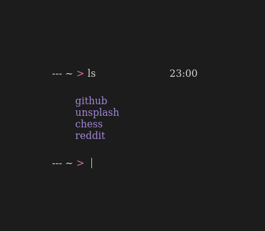

The idea is to have a minimal but functional home page for your browser.

<a href="https://yrwq.github.io/termstart">Try it!</a>

# Usage

Keys:
- `Enter and Space`: focus prompt

Commands:
- `ls` - list all sites
- `open <site's name>` open a site
- `search <something>` search with duckduckgo
- `del <site's name>` delete a site
- `add <site's name> <site's url>` add a site

# Contributing

Feel free to open issues, suggesting features or other things!

Any contributions, are very welcome.
