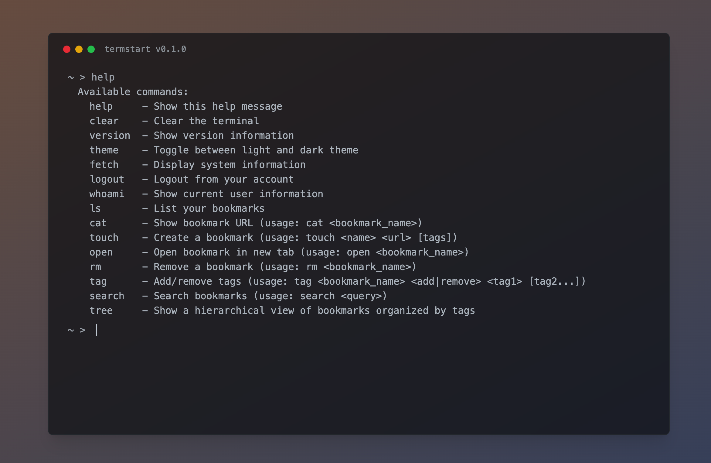
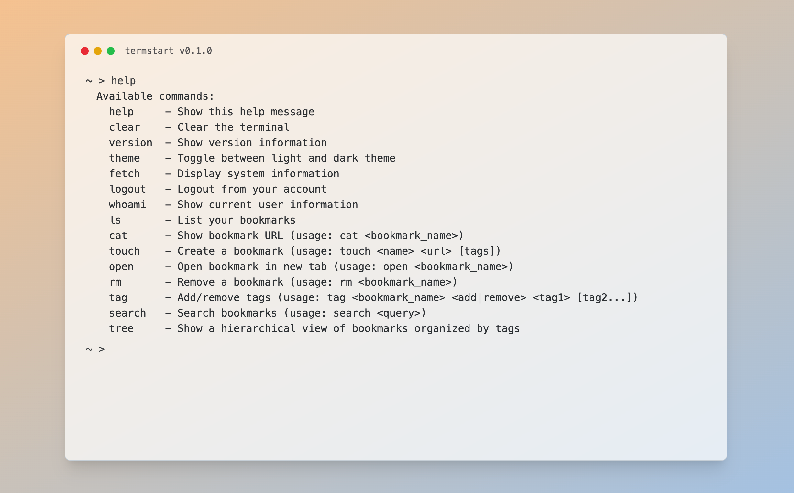

# termstart

<div align="center">
    
    

<br>
<h4>A terminal-themed startpage and bookmark manager for web browsers </h4>

</div>

## Features

- Terminal-inspired user interface
- Bookmark management
- Supabase integration

### Tech Stack

- **Frontend**: Rust + Yew (WebAssembly)
- **Styling**: Tailwind CSS
- **Backend**: Supabase

## Usage

### Basic Commands

- `help` - Show available commands
- `clear` - Clear the terminal
- `version` - Show version information
- `theme` - Toggle between light and dark theme
- `fetch` - Display system information

### Authentication

- `register` - Create a new account
- `login <email> <password>` - Login to your account
- `logout` - Logout from your account
- `whoami` - Show current user information

### Bookmark Management

- `ls [tag]` - List your bookmarks (optionally filtered by tag)
- `cat <bookmark_name>` - Show bookmark URL
- `touch <name> <url> [tags]` - Create a bookmark with optional tags
- `open <bookmark_name>` - Open bookmark in new tab
- `rm <bookmark_name>` - Remove a bookmark
- `tag <bookmark_name> <add|remove> <tag1> [tag2...]` - Add or remove tags from a bookmark
- `search <query>` - Search bookmarks by name or tags
- `tree` - Show a hierarchical view of bookmarks organized by tags

### Navigation

- `cd <tag>` - Navigate to a tag directory
- `cd ..` - Navigate back to root

### Keyboard Shortcuts

- `Tab` - Completion for commands, tags and bookmarks
- `↑/↓` - Navigate command history
- `Home` - Move cursor to start of line
- `End` - Move cursor to end of line

## Setup

### Docker Setup (Recommended)

The easiest way to get started is using Docker:

```bash
docker compose up --build
```

This will build and run the application locally in a container.

### Manual Setup

1. Install Trunk (Rust WASM build tool):

```bash
# Source (recommended)
cargo install --locked trunk

# Binary
cargo binstall trunk

# Homebrew
brew install trunk

# For Apple Silicon: Install wasm-bindgen from source
cargo install --locked wasm-bindgen-cli
```

2. Install WebAssembly target:

```bash
rustup target add wasm32-unknown-unknown
```

3. Run the development server:

```bash
trunk serve --open
```

## Contributing

Contributions are welcome! Please feel free to submit a Pull Request.